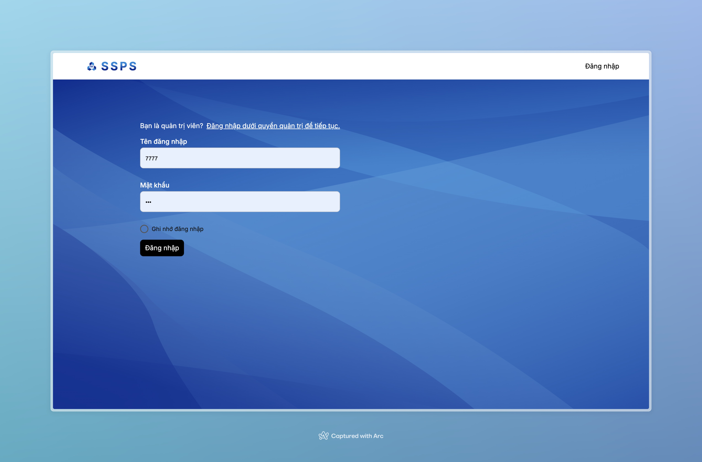
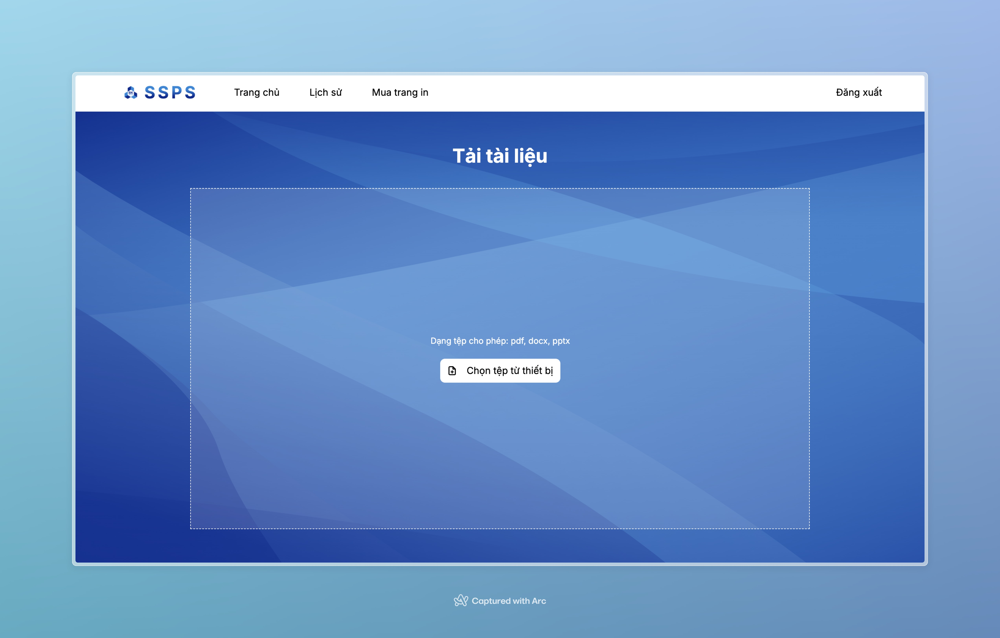
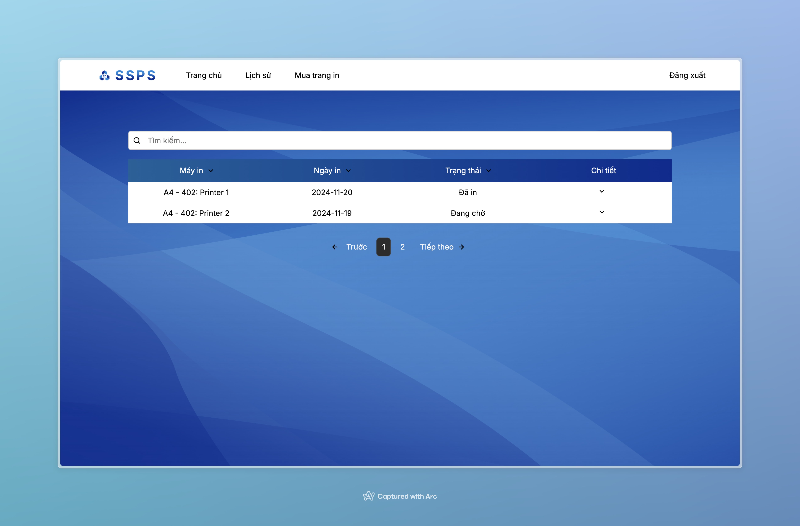
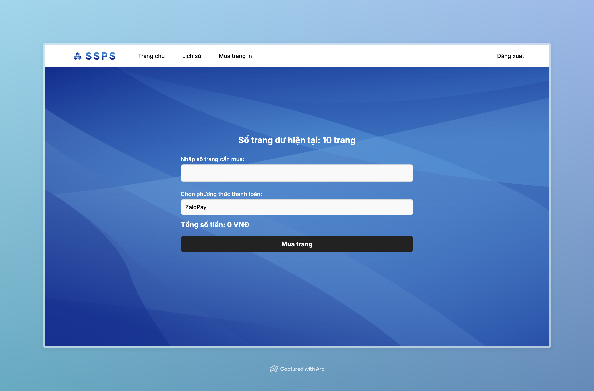

# HCMUT-SPSS-SE241
Software Engineering Project - Semester 241

HCMUT_SSPS is a smart printing service that allows HCMUT students to pre-order print jobs, bypassing queues. It keeps track of print details such as metadata, quantity, date, time, and location, which students can review at any time. The system is managed by the Student Printing Service Officer (SPSO), who oversees configurations, printer operations, and monitors performance and usage statistics, including users' print histories.

## Project Overview
This project consists of two main parts:
1. **Backend**: Handles server-side logic and APIs.
2. **Frontend**: Provides the user interface and interactions with the backend.

## Screenshots
Below are screenshots of some pages of the application:

### 1. Login Page


### 2. Homepage


### 3. History Page


### 4. Buy Page


---

## Running the Project Locally

### 1. **Backend**
To run the backend locally:

1. Navigate to the `backend` directory:
   ```bash
   cd HCMUT\ SSPS/backend
   ```

2. Install dependencies:
    ```bash
    pip install -r requirements.txt
    ```

3. Run the backend server:
   ```bash
   python hello.py
   ```

This will start the backend, and the API will be available for the frontend to consume.

### 2. **Frontend**
To run the frontend locally:

1. Navigate to the `front-end` directory:
   ```bash
   cd HCMUT\ SSPS/front-end
   ```

2. Install the necessary dependencies:
   ```bash
   npm install
   ```

3. Start the development server:
   ```bash
   npm run app:dev
   ```

4. Open your browser to see the web application running locally.

---

## Team Members
1. Tran Chi Tai – 2252727
2. Phan Tran Y Nhi – 2252583
3. Phan Chi Vy – 2252938
4. Tran Dinh Dang Khoa – 2211649
5. Tran Nguyen Anh Khoi – 2252383
